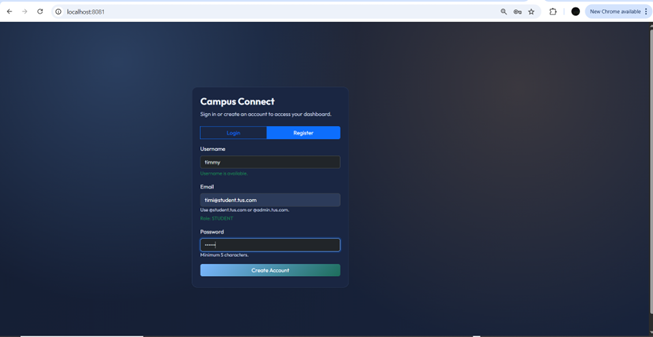

# Campus Connect

Campus Connect is a single-page web application that lets students browse clubs and events, register or cancel registrations, and lets administrators manage clubs, events, and participation analytics.

---

## Tech Stack
Spring Boot, Spring Security (JWT), Spring Data JPA, MySQL, JavaScript, jQuery, Bootstrap, DataTables, Chart.js.

---

## Quick Start
**Prerequisites:** Java 17, Maven 3.9+, MySQL 8+

1. Create a MySQL database named `campus_connect_db`.
2. Update `spring.datasource.*` in [application.properties](C:/Users/osiyo/campus-connect/src/main/resources/application.properties).
3. Run:
```bash
mvn spring-boot:run
```
The app runs on `http://localhost:8081`.

---

## Feature Walkthrough (Add Screenshots)
Replace each placeholder with a screenshot of the feature.

### 1) Login & Register
Use this to access the system. Roles are assigned automatically from the email domain.
1. Open the app in your browser.
2. Click **Register** to create an account or **Login** to sign in.
3. For registration, use `@student.tus.com` or `@admin.tus.com` to set the role.
4. Submit the form to enter the dashboard.



### 2) Student Dashboard
The student dashboard provides quick access to browsing and registrations.
1. Log in with a student account.
2. The dashboard loads automatically after login.
3. Use the sidebar to navigate to **Browse Clubs**, **Browse Events**, or **My Registrations**.


### 3) Browse Clubs
Browse active clubs and drill into events under each club.
1. Log in as a student or admin.
2. Click **Browse Clubs** in the sidebar.
3. Use the search input to find a club by name.
4. Click a club card to view events within that club.


### 4) Club Detail (Clickable Cards)
Clicking a club reveals its events, capacity, and registration status in-place.
1. Open **Browse Clubs**.
2. Click a club card to expand its event list.
3. Review the capacity left and your registration status.
4. If you are a student, use the **Register** button from this view.


### 5) Browse Events
Browse all upcoming events, filter by category, and sort by date.
1. Log in as a student or admin.
2. Click **Browse Events** in the sidebar.
3. Search by event name or select a category.
4. Use the sort dropdown to order by date.


### 6) Event Registration (Success)
Register for an event with available capacity.
1. Log in as a student.
2. Find an event via **Browse Events** or through a club card.
3. Click **Register**.
4. Confirm the success message and see it appear in **My Registrations**.


### 7) Event Registration (Full or Already Registered)
The UI blocks duplicate or full registrations and shows a clear message.
1. Log in as a student.
2. Navigate to the event card.
3. If the event is full or you are already registered, the button is disabled and a message is shown.


### 8) My Registrations (Cancel)
Cancel an existing registration and free the spot for others.
1. Log in as a student.
2. Click **My Registrations**.
3. Find the event and click **Cancel**.
4. Confirm the prompt and verify the cancellation message.


### 9) Admin Dashboard
The admin dashboard is the landing area for management and reporting.
1. Log in with an admin account.
2. The admin dashboard loads automatically.
3. Use the sidebar to access **Manage Clubs** or the participation dashboard.


### 10) Manage Clubs (Create/Update)
Create and edit clubs from the admin management screen.
1. Log in as an admin.
2. Click **Manage Clubs**.
3. Fill in the club form and click **Create**.
4. Use **Edit** on a club row to update details.


### 11) Manage Clubs (Deactivate/Reactivate/Delete)
Deactivate to hide a club, reactivate to restore it, or delete to remove it entirely.
1. Log in as an admin and open **Manage Clubs**.
2. Click **Deactivate** to hide a club from browsing.
3. Click **Activate** to make it visible again.
4. Click **Delete** and confirm to remove the club and its events.


### 12) Manage Events (Create/Update/Delete)
Manage events for a selected club, including validation for future dates.
1. Log in as an admin and open **Manage Clubs**.
2. Select a club in the events section.
3. Create a new event with a future start time and valid capacity.
4. Use **Edit** or **Delete** on an event row to update or remove it.


### 13) Admin Registration View
View registered students for any event.
1. Log in as an admin.
2. Open **Manage Clubs** and select a club event.
3. Open the registrations table to view registered users.


### 14) Participation Dashboard (Charts)
See participation analytics across events and clubs.
1. Log in as an admin.
2. Click the dashboard action to load participation charts.
3. Review registrations per event and top clubs by total registrations.


### 15) Past Events & Completed Registrations
Past events are hidden from browse lists, and completed registrations are labeled.
1. Log in as a student.
2. Browse events and note that past events are not shown.
3. In **My Registrations**, completed events show a **COMPLETED** status.


---

## API Endpoints (Summary)
Full documentation is available in Swagger at `http://localhost:8081/swagger-ui/index.html`.

### Public/Authenticated (Student + Admin)
- `GET /api/clubs` (browse active clubs)
- `GET /api/events` (browse active events)
- `GET /api/user/me` (current user profile)

### Auth
- `POST /api/auth/login` (log in)
- `POST /api/auth/register` (register)
- `GET /api/auth/username-available?username=` (check username availability)

### Student
- `POST /api/student/events/{eventId}/register` (register for an event)
- `GET /api/student/registrations` (list my registrations)
- `DELETE /api/student/registrations/{registrationId}` (cancel my registration)

### Admin – Clubs
- `GET /api/admin/clubs` (list all clubs)
- `POST /api/admin/clubs` (create a club)
- `PUT /api/admin/clubs/{id}` (update a club)
- `PUT /api/admin/clubs/{id}/activate` (activate a club)
- `DELETE /api/admin/clubs/{id}` (deactivate a club)
- `DELETE /api/admin/clubs/{id}/delete` (delete a club)

### Admin – Events
- `GET /api/admin/clubs/{clubId}/events` (list events for a club)
- `POST /api/admin/clubs/{clubId}/events` (create an event)
- `PUT /api/admin/events/{eventId}` (update an event)
- `DELETE /api/admin/events/{eventId}` (delete an event)

### Admin – Registrations
- `GET /api/admin/events/{eventId}/registrations` (list registrations for an event)
- `DELETE /api/admin/events/{eventId}/registrations/{registrationId}` (unregister a student)

### Admin – Participation Reporting
- `GET /api/admin/participation` (registrations per event and top clubs)

---

## Testing
Run the integration test suite (Cucumber E2E):
```bash
.\mvnw -P e2e verify
```
